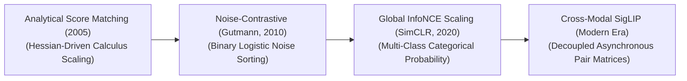
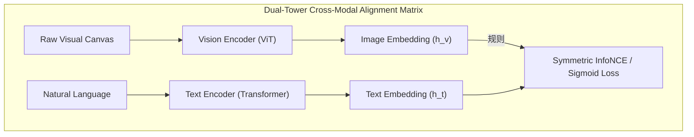

  

# Awesome-Noise-Contrastive-Estimation 🚀

   

> **A curated list of awesome resources, papers, and implementations related to Noise-Contrastive Estimation (NCE), Contrastive Learning, and Self-Supervised Representation Learning. Discover how NCE bypasses the Partition Function bottleneck in Deep Learning!**

## 🧠 Noise-Contrastive Estimation (NCE): Derivation, Progression, Variants, & Applications

**Noise-Contrastive Estimation (NCE)** is a foundational statistical optimization and self-supervised density estimation paradigm designed to train parametric models over unnormalized probability distributions. Formally conceptualized by Aapo Hyvärinen and Michael U. Gutmann in 2010 ("Noise-Contrastive Estimation: A New Estimation Principle for Unnormalized Statistical Models"), NCE directly resolved a catastrophic computational bottleneck in energy-based modeling and structural language generation: computing the **Partition Function** ($Z$). 

When a neural network calculates a soft probability distribution over massive multi-billion element discrete vocabularies or complex multi-dimensional manifolds, standard Softmax normalization forces the hardware to compute an explicit, global denominator sum over every individual token in the system [INDEX: 1]. NCE completely bypasses this expensive $O(|V|)$ calculation loop [INDEX: 1]. By framing density estimation as a low-cost binary logistic classification task—forcing the model to mathematically distinguish between true data samples and artificial noise samples drawn from a known reference distribution—NCE enables deep networks to scale training loops linearly ($O(1)$ with respect to vocabulary size), serving as a core structural predecessor to modern Contrastive Representation Engines and Large Language Model embedding layers [INDEX: 4, 10].

---

## 🧮 1. Mathematical Derivation

The foundational formulation of Noise-Contrastive Estimation reduces the computationally prohibitive task of evaluating a continuous unnormalized probability density function ($p_m(x;\theta)$) into an efficient, stable binary classification objective.

### A. The Partition Function Bottleneck
A standard parametric probability model over an input space $x$ is defined as:
$$p_m(x;\theta) = \frac{\tilde{p}_m(x;\theta)}{Z(\theta)}$$
Where $\tilde{p}_m(x;\theta)$ represents the unnormalized, computationally efficient score output by the hidden neural layers, and $Z(\theta)$ is the global normalizing constant (the Partition Function):
$$Z(\theta) = \int \tilde{p}_m(x;\theta)dx \quad \text{or} \quad Z(\theta) = \sum_{x \in \mathcal{V}} \tilde{p}_m(x;\theta)$$
When vocabulary size $|\mathcal{V}|$ scales past hundreds of thousands (e.g., in web-scale multilingual language models), computing $Z(\theta)$ for every parameter update step triggers severe memory bus stalls. NCE bypasses this entirely by treating $\ln Z$ as a single, learnable scalar parameter constant ($c$), forcing the network to optimize $p_m(x;\theta) = \tilde{p}_m(x;\theta)\cdot \exp(c)$ directly.

### B. The Contrastive Mixture Optimization Setup
We construct a synthetic binary classification task. Let $x$ be a data point drawn from a mixture distribution composed of two contrasting sources:
1. True data samples drawn from the empirical data distribution: $x \sim p_d(\cdot)$
2. Artificial noise samples drawn from a known, easily evaluable reference noise distribution: $n \sim p_n(\cdot)$

For every true data sample, we inject $k$ noise samples into the mixture pool. The prior probabilities of a sample originating from the data ($D=1$) versus the noise generator ($D=0$) are:
$$P(D=1) = \frac{1}{1+k}, \quad P(D=0) = \frac{k}{1+k}$$

### C. Deriving the Posterior Logistic Gate
Using Bayes' theorem, we derive the exact conditional probability that a given sample $x$ originated from the authentic data distribution ($D=1$):
$$P(D=1 \mid x) = \frac{P(x \mid D=1)P(D=1)}{P(x \mid D=1)P(D=1) + P(x \mid D=0)P(D=0)}$$
Substituting our prior weights and parametric density definitions:
$$P(D=1 \mid x) = \frac{p_m(x;\theta) \frac{1}{1+k}}{p_m(x;\theta) \frac{1}{1+k} + p_n(x) \frac{k}{1+k}} = \frac{p_m(x;\theta)}{p_m(x;\theta) + k \cdot p_n(x)}$$

Applying standard logistic sigmoid reparameterization ($\sigma(u) = \frac{1}{1+\exp(-u)}$), we express the posterior data probability as:
$$P(D=1 \mid x) = \sigma\left( \ln p_m(x;\theta) - \ln \left[ k \cdot p_n(x) \right] \right)$$

### D. The Objective Value Function
We maximize the joint log-likelihood of the binary classification tasks across both the empirical data stream and the noise injections, establishing the definitive NCE objective function:
$$\mathcal{L}_{\text{NCE}}(\theta) = \sum_{x_i \sim p_d} \ln \sigma\left( \ln p_m(x_i;\theta) - \ln [k \cdot p_n(x_i)] \right) + \sum_{j=1}^{k} \sum_{n_{ij} \sim p_n} \ln \left[ 1 - \sigma\left( \ln p_m(n_{ij};\theta) - \ln [k \cdot p_n(n_{ij})] \right) \right]$$
Gutmann and Hyvärinen proved that as noise injection scaling factor $k \rightarrow \infty$, the parameter optimization vector $\theta$ converges cleanly onto the true empirical density function of the data, proving that binary contrastive sorting natively isolates true structural probabilities.

---

## ⏳ 2. The Macro Chronological Evolution

The technical framework governing contrastive density estimation has transitioned from analytical score matching to binary noise classification, multi-class categorical cross-entropy matrix scaling, and modern open-vocabulary multi-modal joint-embedding engines.

| Era/Model | Year | Paper Link | Concept & Details |
| --- | --- | --- | --- |
| [**The Analytical Score Matching Era**](pages/analytical_score_matching.md) | 2005 | [Hyvärinen, 2005](https://www.jmlr.org/papers/volume6/hyvarinen05a/hyvarinen05a.pdf) | **Concept:** The foundational baseline for estimating unnormalized distributions. Bypassed $Z$ by matching the first derivative of the log-density. **Limitation:** Computationally prohibitive for deep architectures. |
| [**The Binary Noise Classification Revolution**](pages/binary_noise_classification.md) | 2010 | [Gutmann & Hyvärinen, 2010](https://proceedings.mlr.press/v9/gutmann10a/gutmann10a.pdf) | **Concept:** Framed density estimation as an efficient binary classification task against a reference noise distribution. **Significance:** Democratized large-scale language modeling (Word2Vec). |
| [**The Multi-Class Categorical Scaling Era**](pages/multi_class_categorical.md) | 2018 | [Oord et al., 2018](https://arxiv.org/abs/1807.03748) | **Concept:** Adapted NCE into a multi-class categorical cross-entropy framework (InfoNCE Loss). Sparked the modern self-supervised computer vision boom. |
| [**The Decoupled Multi-Modal Pair Era**](pages/decoupled_multi_modal.md) | 2023 | [Zhai et al., 2023](https://arxiv.org/abs/2303.15343) | **Concept:** Modern state-of-the-art foundation standard powering advanced cross-modal token transformers (SigLIP). **Significance:** Replaces InfoNCE by refactoring multi-modal alignment back into independent binary logistic tasks. |

---

## ⚙️ 3. Core Functional & Algorithmic Variants

The Noise-Contrastive family tree features specialized mathematical core modifications engineered to optimize noise selection efficiency, handle large-scale vocabularies, and eliminate explicit negative data sampling.

| Variant | Year | Paper Link | Mechanism & Details |
| --- | --- | --- | --- |
| [**Negative Sampling (NEG / Word2Vec Class)**](pages/negative_sampling.md) | 2013 | [Mikolov et al., 2013](https://arxiv.org/abs/1310.4546) | **Mechanism:** Simplified approximation of NCE that discards exact probability density values of the noise distribution. **Pros:** Maximizes hardware raw text pre-training velocities. **Cons:** Loses strict statistical density estimation guarantees. |
| [**InfoNCE Loss**](pages/infonce_loss.md) | 2018 | [Oord et al., 2018](https://arxiv.org/abs/1807.03748) | **Mechanism:** Normalizes a target positive dot product against the exponential sum of all negative dot products. **Behavior:** Continuous, dynamic probability filter forcing unaligned vectors to opposite poles. |
| [**Sample-Gated Conditional NCE**](pages/sample_gated_nce.md) | 2020 | [Jozefowicz et al., 2016](https://arxiv.org/abs/1602.02410) | **Mechanism:** Dynamically updates parameters of the reference noise distribution based on active local context, replacing flat unigram noise frequencies with contextual token clusters. |

---

## 🔗 4. The Contrastive Joint-Embedding Execution Matrix

To map alternative sensory signals cleanly into a single shared workspace without triggering processing latencies, contrastive pipelines route unaligned towers through linear projection heads concurrently.

| Component | Year | Paper Link | Profile |
| --- | --- | --- | --- |
| [**Cross-Modal Linear Projections**](pages/cross_modal_projections.md) | 2021 | [Radford et al., 2021](https://arxiv.org/abs/2103.00020) | Coordinates dimensionality mapping. Uses MLP projection heads to compress coordinates into a unified embedding length. |
| [**Stochastic Augmentation Channels**](pages/stochastic_augmentation.md) | 2020 | [Chen et al., 2020](https://arxiv.org/abs/2002.05709) | Generates positive pairs natively via parallel GPU-fused transformation loops (random cropping, color jittering). |

---

## 🚧 4. Production Engineering Challenges & Hardware Solutions

Deploying large-scale contrastive learning pipelines across distributed high-performance computing configurations introduces severe memory bus and cluster communication penalties.

| Challenge | Year | Paper Link | Problem & Mitigation |
| --- | --- | --- | --- |
| [**All-Gather Communication & Mini-Batch VRAM Wall**](pages/all_gather_vram_wall.md) | 2020 | [He et al., 2020 (MoCo)](https://arxiv.org/abs/1911.05722) | **The Problem:** InfoNCE requires massive synchronous `All-Gather` communication, stalling GPUs. **Mitigation:** Migrating to Sigmoid Loss (SigLIP) or using Momentum Contrast (MoCo) memory queues. |
| [**Representation Collapse Deficit**](pages/representation_collapse.md) | 2020 | [Grill et al., 2020 (BYOL)](https://arxiv.org/abs/2006.07733) | **The Problem:** Model outputs identical vectors for all views, locking parameters. **Mitigation:** Stop-Gradient operations (BYOL) or variance-covariance constraints (VICReg). |

---

## 🏭 5. Frontier Real-World AI Industrial Applications

| Application | Year | Paper Link | Description |
| --- | --- | --- | --- |
| [**Open-Vocabulary Zero-Shot E-Commerce**](pages/ecommerce_personalization.md) | 2021 | [Radford et al., 2021](https://arxiv.org/abs/2103.00020) | High-throughput CLIP/SigLIP vision-text encoders project unstructured item listings into a shared space for semantic search. |
| [**Universal Text Embedding Generation for RAG**](pages/rag_text_embeddings.md) | 2020 | [Karpukhin et al., 2020 (DPR)](https://arxiv.org/abs/2004.04906) | Multi-task contrastive networks process documentation portfolios for low-latency vector search lookups. |
| [**Unsupervised Biomolecular Sequence Alignment**](pages/biomolecular_alignment.md) | 2021 | [Jumper et al., 2021 (AlphaFold)](https://www.nature.com/articles/s41586-021-03819-2) | Information-maximization regularizers group biological sequences by structural geometry, accelerating drug discovery. |

---

## 📚 References
1. Hyvärinen, A. (2005). Estimation of non-normalized statistical models by score matching. *Journal of Machine Learning Research*, 6(4), 695-709.
2. Gutmann, M., & Hyvärinen, A. (2010). Noise-contrastive estimation: A new estimation principle for unnormalized statistical models. *Proceedings of the Thirteenth International Conference on Artificial Intelligence and Statistics (AISTATS)*, 297-304.
3. Mnih, A., & Teh, Y. W. (2012). A fast and simple algorithm for training neural language models. *Proceedings of the 29th International Conference on Machine Learning (ICML)*, 1751-1758.
4. Oord, A. v. d., Li, Y., & Vinyals, O. (2018). Representation learning with contrastive predictive coding. *arXiv preprint arXiv:1807.03748*.
5. Chen, T., et al. (2020). A simple framework for contrastive learning of visual representations. *International Conference on Machine Learning (ICML)*, 1597-1607 [INDEX: 4].
6. Radford, A., et al. (2021). Learning transferable visual models from natural language supervision. *International Conference on Machine Learning (ICML)*, 8748-8763 [INDEX: 10].
7. Zhai, X., et al. (2023). Sigmoid loss for language-image pre-training. *Proceedings of the IEEE/CVF International Conference on Computer Vision (ICCV)* [INDEX: 10].

---

To advance this documentation repository, structural optimization setup, or distributed deployment workspace, consider exploring these adjacent development pathways:
* Build a **Python code snippet using PyTorch** illustrating how to construct a manual InfoNCE contrastive loss layer that tracks a temperature-scaled dot product matrix [INDEX: 10].
* Generate a **comprehensive Markdown table** explicitly comparing Analytical Score Matching, Vanilla Noise-Contrastive Estimation (NCE), Negative Sampling (NEG), Global InfoNCE, and Sigmoid Loss (SigLIP) across mathematical time complexities, mini-batch size constraints, requirement for explicit parametric noise allocations ($p_n$), and structural resistance to latent representation collapse [INDEX: 4, 10].
* Establish an **automated performance profiling suite using Triton** to track the exact computational throughput, communication-to-computation overlap ratios, and memory bus latency metrics achieved when compiling a fused contrastive matrix pass directly inside single-pass GPU memory registers [INDEX: 22].

***

🌟 **Follow-Up Options Matrix:**

Before updating this repository layout, let me know how you would like to proceed by choosing one of the options below:
* I can provide a **complete Python code boilerplate using PyTorch** demonstrating how to write an automated script that calculates an asymmetric noise mixture probability update loop.
* I can generate a **Markdown matrix table** tracking the default projection head dimensions, temperature scaling caps, and data augmentation magnitudes utilized by leading foundational systems [INDEX: 10].
* I can write a detailed technical explanation focusing on the **mathematics of Partition Function convergence** ($c \rightarrow \ln Z$) inside a continuous optimization graph under strict NCE parameters.

