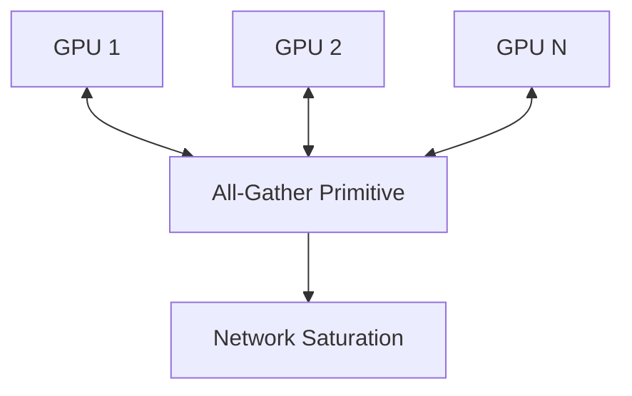

# All-Gather Communication & Mini-Batch VRAM Wall

[<- Back to Home](../README.md)

## Overview
Because InfoNCE relies on a global denominator over massive batches to provide enough negative samples, distributed clusters face severe communication bottlenecks. Systems stall while waiting to synchronize thousands of embeddings across GPUs. Modern pipelines solve this with MoCo queues or SigLIP element-wise matrices.

## Architecture Architecture

