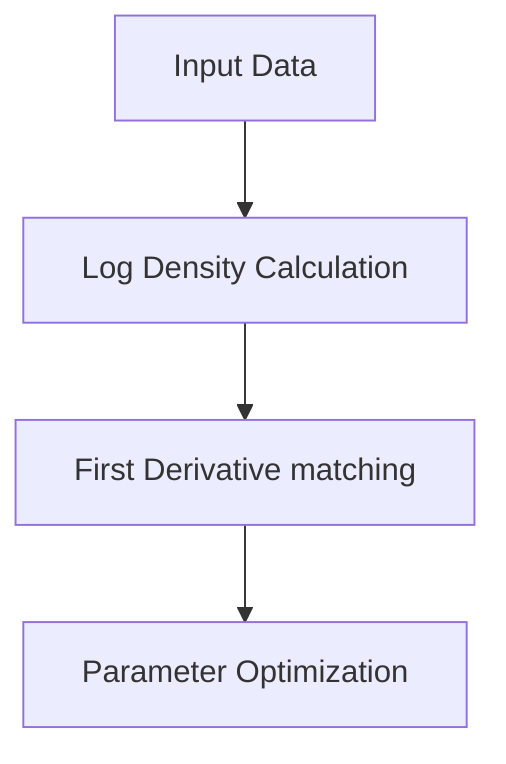

# The Analytical Score Matching Era

[<- Back to Home](../README.md)

## Overview
Introduced by Hyvärinen in 2005, Analytical Score Matching provided a foundational mathematical approach to bypass the computational bottleneck of the Partition Function ($Z$). By optimizing the neural network to match the first derivative of the log-density instead of the actual density, the constant $Z$ is eliminated in the gradient ($
abla_x \ln Z = 0$). While mathematically elegant, evaluating the trace of the Hessian matrix ($
abla_x^2 \ln p(x)$) introduced quadratic complexity that crippled scaling efforts in deep neural network contexts.

## Architecture Architecture

