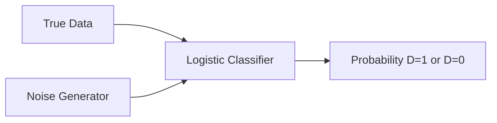

# The Binary Noise Classification Revolution

[<- Back to Home](../README.md)

## Overview
Conceptualized by Gutmann and Hyvärinen in 2010, the Binary Noise Classification approach (NCE) reframed complex probability estimation into a straightforward logistic regression problem. By forcing a model to distinguish between genuine data samples and mathematically generated noise samples, NCE bypasses expensive vocabulary-wide Softmax calculations. This breakthrough directly enabled the creation of high-efficiency natural language processors like Word2Vec.

## Architecture Architecture

