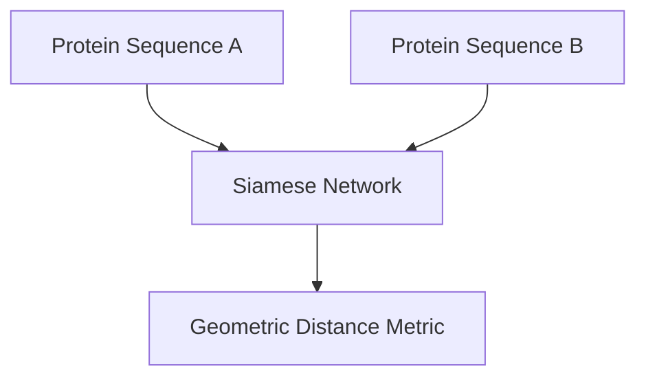

# Unsupervised Biomolecular Sequence Alignment

[<- Back to Home](../README.md)

## Overview
Using contrastive objective functions to automatically group and map unannotated DNA, RNA, or peptide structures based on structural similarities. Critical for zero-shot mutation tracking and target drug discovery.

## Architecture Architecture

