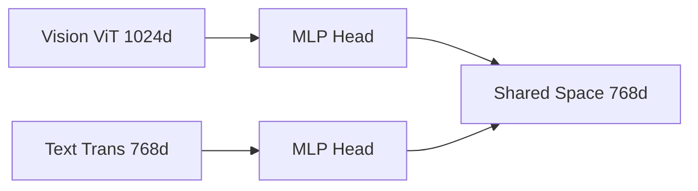

# Cross-Modal Linear Projections

[<- Back to Home](../README.md)

## Overview
To execute multi-modal dot products, models like CLIP use small Multi-Layer Perceptron (MLP) projection heads. These layers compress independent text and vision backbone outputs into a single, unified coordinate space for rapid similarity calculations.

## Architecture Architecture

