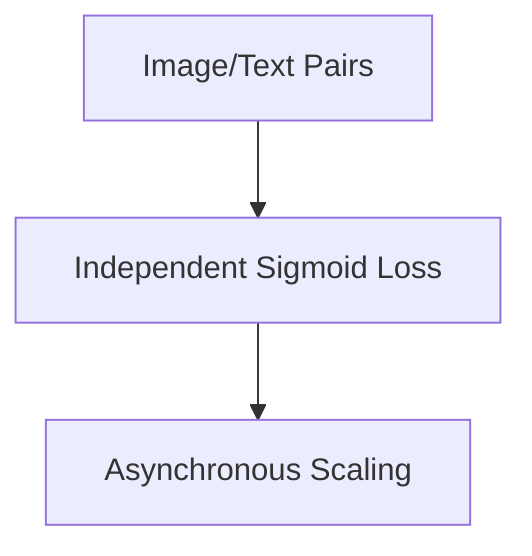

# The Decoupled Multi-Modal Pair Era

[<- Back to Home](../README.md)

## Overview
Modern architectures such as SigLIP bypass the InfoNCE `All-Gather` VRAM limitation by decomposing contrastive learning back into decoupled, independent binary logistic operations. By computing an element-wise sigmoid loss rather than a global Softmax, massive distributed clusters can train multi-modal transformers without network bandwidth bottlenecks.

## Architecture Architecture

