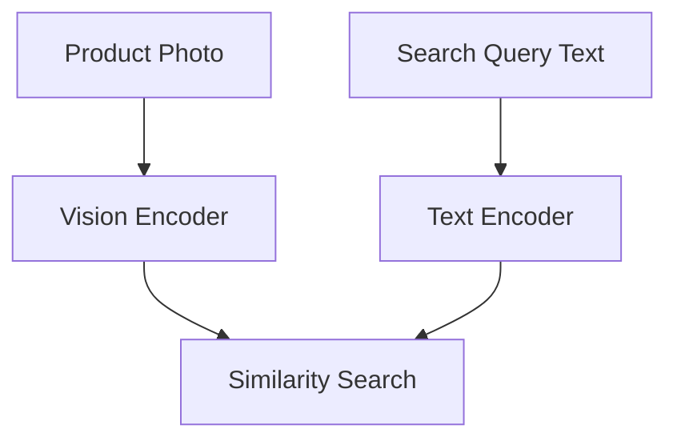

# Open-Vocabulary Zero-Shot E-Commerce

[<- Back to Home](../README.md)

## Overview
Transforms consumer search architecture by projecting raw item images and conversational text into the same multi-dimensional coordinate space. Enables instant, highly accurate visual matching without requiring human data labeling.

## Architecture Architecture

