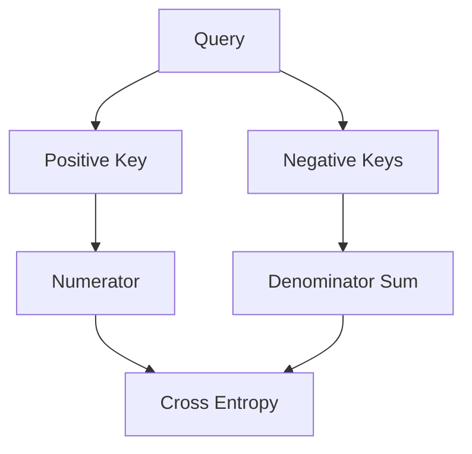

# InfoNCE Loss

[<- Back to Home](../README.md)

## Overview
Categorical Contrastive Cross-Entropy Normalizes positive dot products against an exponential sum of negative products within a batch. It relies on a temperature parameter to dynamically filter vectors and push unaligned items across the latent space.

## Architecture Architecture
```mermaid
math
\mathcal{L} = -\log \frac{\exp(\text{sim}(q, k_+) / \tau)}{\sum \exp(\text{sim}(q, k_i) / \tau)}
```

