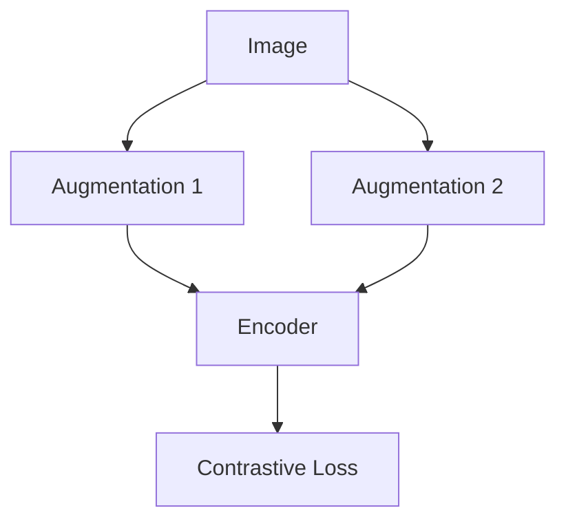

# The Multi-Class Categorical Scaling Era

[<- Back to Home](../README.md)

## Overview
The InfoNCE loss function (Oord et al., 2018) scaled contrastive learning by matching data against a dynamic batch of negative samples. Instead of relying on a static mathematical noise distribution, InfoNCE treats augmented variations of an image as a positive pair and all other batch items as negative pairs. This structural evolution powers modern computer vision self-supervised models like SimCLR and MoCo.

## Architecture Architecture

