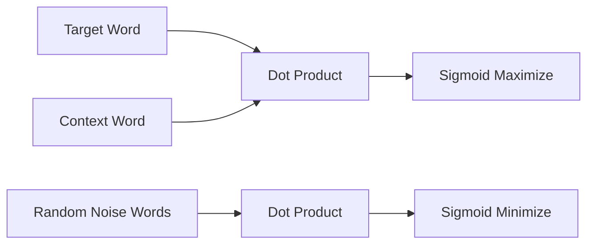

# Negative Sampling (NEG / Word2Vec Class)

[<- Back to Home](../README.md)

## Overview
A simplified approximation of NCE popularized by Mikolov (2013). NEG discards the mathematical density calculations of the noise distribution to minimize computational overhead. While it loses strict statistical guarantees, its sheer speed allows models like Skip-Gram to process billions of text tokens efficiently.

## Architecture Architecture

