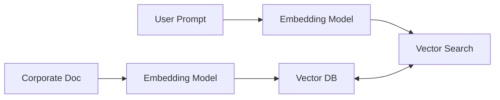

# Universal Text Embedding Generation for RAG

[<- Back to Home](../README.md)

## Overview
Powering Enterprise AI workflows by converting extensive documentation portfolios into high-density geometric vectors. These indices act as the backbone for Retrieval-Augmented Generation engines.

## Architecture Architecture

