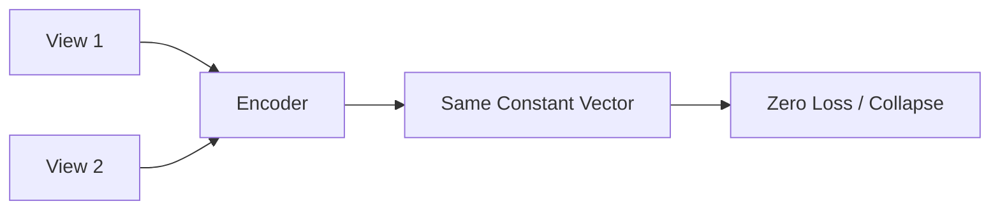

# Representation Collapse Deficit

[<- Back to Home](../README.md)

## Overview
Without explicit negative samples, neural networks naturally default to outputting a constant, identical vector for all inputs to trivially achieve zero contrastive loss. Solutions involve asymmetric architectures with Stop-Gradient tracking (BYOL) or variance preservation metrics (VICReg).

## Architecture Architecture

