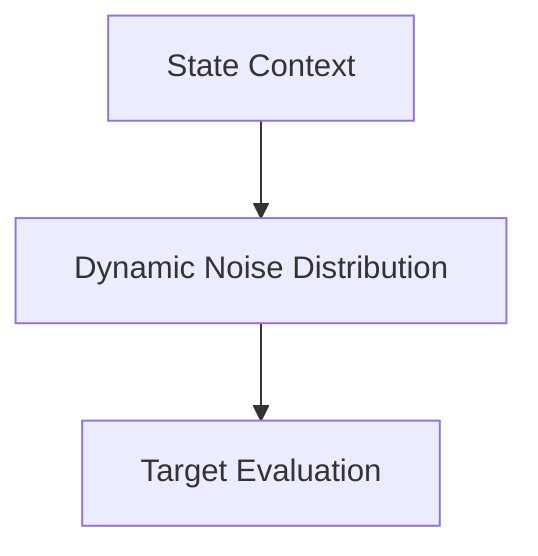

# Sample-Gated Conditional NCE

[<- Back to Home](../README.md)

## Overview
Dynamically modifies the reference noise distribution based on the network's active contextual state. Instead of relying on static, uniform frequencies, this algorithm targets specific token clusters, maximizing the gradient slope and learning efficiency.

## Architecture Architecture

