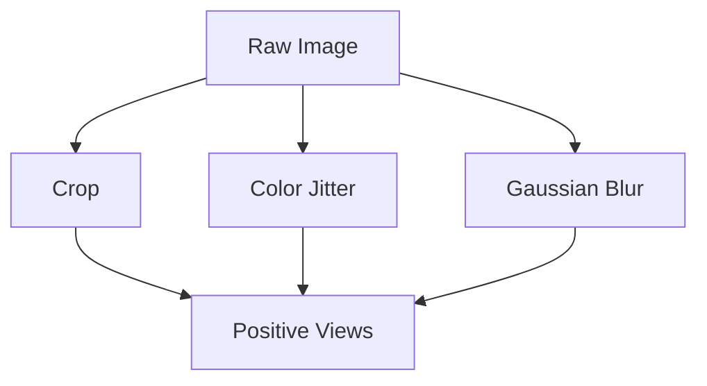

# Stochastic Augmentation Channels

[<- Back to Home](../README.md)

## Overview
Self-supervised visual pipelines generate positive pairs by pushing identical images through randomized, GPU-fused data transformations. By cropping, jittering, or applying solarization, the model is forced to ignore superficial pixel patterns and learn core structural semantics.

## Architecture Architecture

